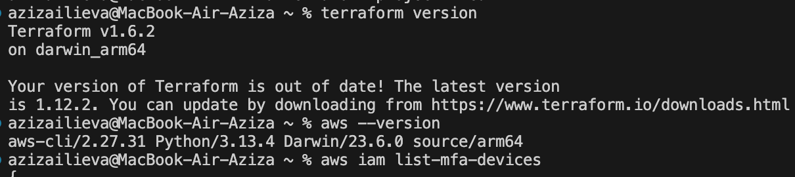

# AWS Infrastructure Deployment via Terraform & GitHub Actions

This project sets up AWS infrastructure using Terraform and deploys it through a secure GitHub Actions workflow. It includes creating necessary IAM configurations, S3 backend for state management, and automating the deployment process.

#MFA User Configured (10 points)

#CLI tools version:

#Bucket and GithubActionsRole IAM role configured (20 points)
  AWS provider and backend configured for S3:
terraform {
  required_providers {
    aws = {
      source  = "hashicorp/aws"
      version = "~> 5.0"
    }
  }
  
  backend "s3" {
    bucket         = "aziza-tfstate-20250607"
    key            = "state/terraform.tfstate"
    region         = "us-east-1"
    encrypt        = true
  }
}

provider "aws" {
  region = var.region

}
  
  Versioned S3 bucket created:
esource "aws_s3_bucket" "aziza_test_bucket" {
  bucket = var.bucket_name

  tags = {
    Name        = "Terraform State Bucket"
    Environment = var.environment
  }
}

resource "aws_s3_bucket_versioning" "versioning" {
  bucket = aws_s3_bucket.aziza_test_bucket.id

  versioning_configuration {
    status = "Enabled"
  }
}

#IAM Role GithubActionsRole with trust policy for GitHub OIDC:

resource "aws_iam_openid_connect_provider" "github" {
  url             = "https://token.actions.githubusercontent.com"
  client_id_list  = ["sts.amazonaws.com"]
  thumbprint_list = ["7560D6F40FA55195F740EE2B1B7C0B4836CBE103"]
}

resource "aws_iam_role" "github_actions" {
  name = "GithubActionsRole"

  assume_role_policy = jsonencode({
    "Version": "2012-10-17",
    "Statement": [{
            "Effect": "Allow",
            "Principal": {
                "Federated": "arn:aws:iam::381491972551:oidc-provider/token.actions.githubusercontent.com"
            },
            "Action": "sts:AssumeRoleWithWebIdentity",
            "Condition": {
                "StringLike": {
                    "token.actions.githubusercontent.com:sub": "repo:aziza-iliv/rsschool-devops-course-tasks:*"
                },
                "StringEquals": {
                    "token.actions.githubusercontent.com:aud": "sts.amazonaws.com"
                }
            }
        }]
   })
}
 

#GitHub Actions Workflow (30 points)

 The terraform.yml workflow includes:

terraform-check — format validation
terraform-plan — planning
terraform-apply — apply to AWS

#Code Organization (10 points)
.
├── main.tf
├── variables.tf
├── backend.tf
├── outputs.tf
├── .github/
│   └── workflows/
│       └── terraform.yml

