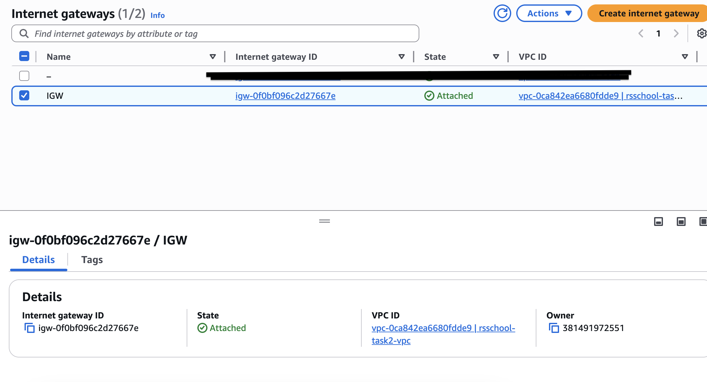

Terraform AWS Infrastructure — Task 2

This project sets up a basic AWS network infrastructure using Terraform. It includes:

- A custom VPC
- 2 public subnets in different availability zones
- 2 private subnets in different availability zones
- Internet Gateway
- NAT Gateway
- Bastion Host
- Security Groups for public and private access

## Screenshots

###  VPC Configuration


###  Internet Gateway


###  Bastion Host


###  Security Groups


###  Subnet


###  Code Organization (Project Structure)
```bash
├── instance.tf                     # Bastion host and instances
├── internet_gateway.tf             # Internet Gateway and NAT Gateway
├── key_pairs.tf                    # SSH key pair for Bastion host
├── output.tf                       # Outputs (e.g., public IPs)
├── provider.tf                     # AWS provider setup
├── route_subnet_association.tf     # Route table associations
├── route_table.tf                  # Public and private route tables
├── securite.tf                     # Security groups
├── subnet.tf                       # Public and private subnets
├── terraform.tfvars                # Variable values
├── variables.tf                    # Variable declarations
├── vpc.tf                          # VPC resource